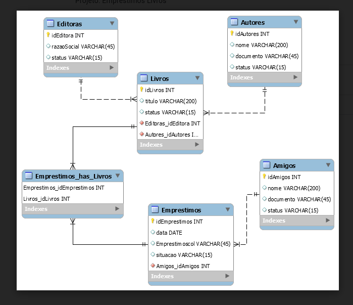

### Tarefas Git To-do

- [ ] Criar a tela principal onde será possível criar todas as operações de entidades relacionadas.
- [ ] Implementar todas as operações de CRUD.
- [ ] Realizar o tratamento de exceções de forma adequada.
- [ ] Entender o funcionamento do JDBC (Java Database Connectivity).
- [ ] Rever o progresso e atualizar conforme necessário.

### Ders

